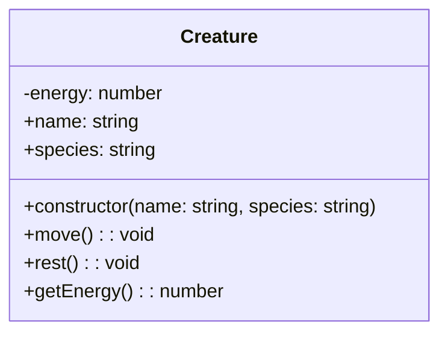
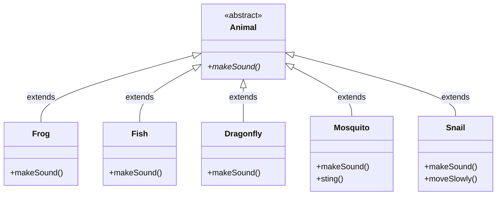
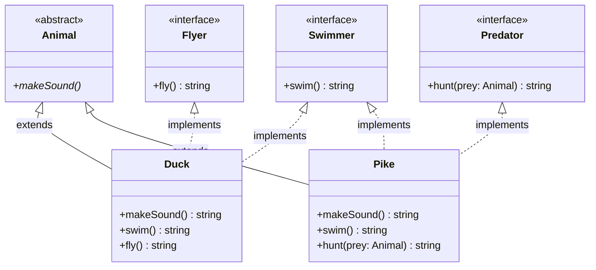
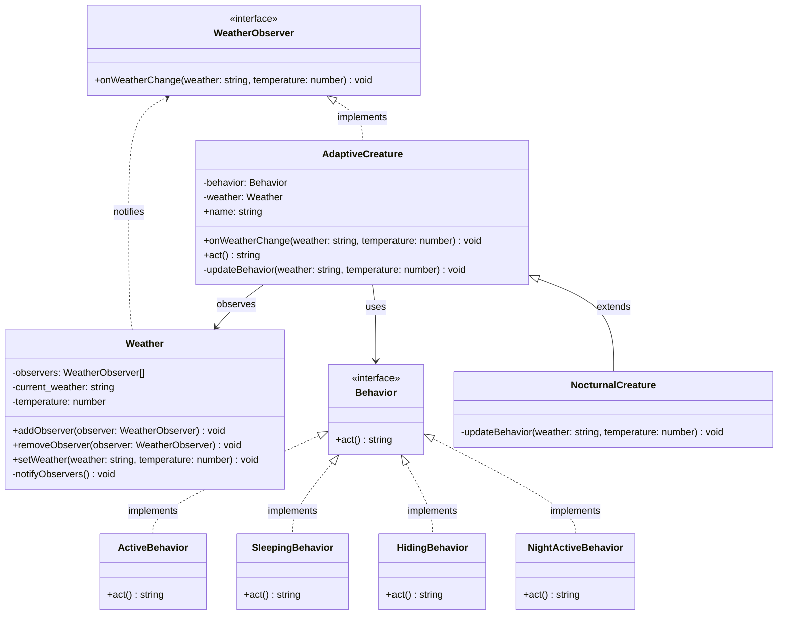

# Diagrammes UML - Exercices de la mare

## EXERCICE 1 : Créatures de la mare

## EXERCICE 2 : Héritage - Types de créatures

## EXERCICE 3 : Interfaces - Comportements

## EXERCICE 4 : Observer + Strategy - Météo et comportements

